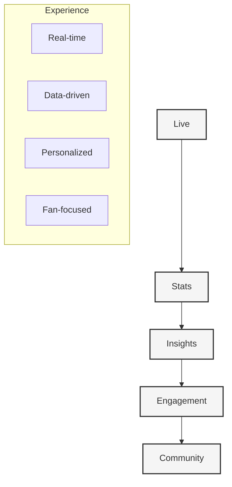

# Drib - Modern Football Digital Experience

#project-overview #documentation #source-of-truth

## Core Philosophy

## Core Documentation

### 1. Foundation
- [[00-project-overview|Project Overview]] - Core vision and goals
- [[01-user-experience|User Experience]] - Design philosophy
- [[02-product-vision|Product Vision]] - Product direction
- [[03-implementation-plan|Implementation Plan]] - Development roadmap

### 2. Technical Architecture
- [[10-system-architecture|System Architecture]] - Core architecture
- [[11-data-pipeline|Data Pipeline]] - Football data integration
- [[12-database-schema|Database Schema]] - Data models
- [[13-development-workflow|Development Workflow]] - Development practices

### 3. Core Features
- [[20-live-matches|Live Matches]] - Real-time match experience
- [[21-statistics-engine|Statistics Engine]] - Advanced stats system
- [[22-player-profiles|Player Profiles]] - Player database
- [[23-team-analytics|Team Analytics]] - Team insights

### 4. User Systems
- [[30-user-profiles|User Profiles]] - Profile system
- [[31-notifications|Notifications]] - Alert system
- [[32-social-features|Social Features]] - Community tools
- [[33-personalization|Personalization]] - User preferences

### 5. Data Integration
- [[40-api-integration|API Integration]] - Football data APIs
- [[41-real-time-updates|Real-time Updates]] - Live data system
- [[42-historical-data|Historical Data]] - Statistics archive
- [[43-data-visualization|Data Visualization]] - Charts and graphics

## Technical Stack

### Core Technologies
- Next.js 15 (App Router)
- React 19
- TypeScript 5
- Tailwind CSS

### State Management
- Zustand for global state
- React Query for server state
- Zod for schema validation

### Database & Storage
- Prisma ORM
- PostgreSQL
- Redis for caching

### Real-time Features
- WebSocket integration
- Server-Sent Events
- Real-time data pipeline

### Data Sources
- Football data providers
- Statistics APIs
- Historical databases

## Development Guidelines

### 1. Data Management
- Real-time data synchronization
- Efficient caching strategies
- Data accuracy validation
- Historical data preservation

### 2. Code Organization
- Feature-based architecture
- Strong typing with TypeScript
- Component modularity
- Performance optimization

### 3. User Experience
- Real-time updates
- Responsive design
- Mobile-first approach
- Offline capabilities

### 4. Testing Strategy
- Unit tests for core logic
- Integration tests for data flow
- E2E tests for critical features
- Performance monitoring

## Future Roadmap

### Phase 1: Core Platform
- Live match experience
- Basic statistics
- User profiles
- Mobile interface

### Phase 2: Enhanced Features
- Advanced analytics
- Social features
- Personalization
- Historical data

### Phase 3: Premium Experience
- Pro statistics
- API access
- Custom alerts
- Fantasy integration 