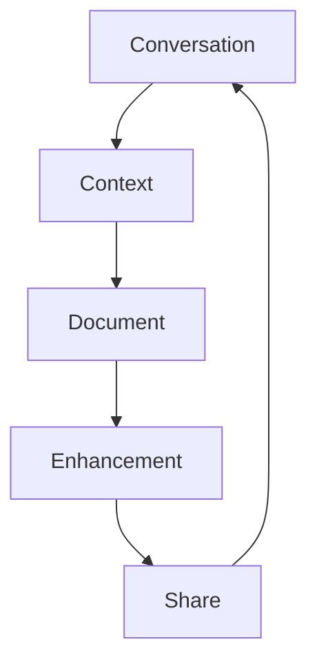

# Context-to-Docs: Technical Implementation

## Core Systems

### 1. Knowledge Flow Interface
```typescript
interface KnowledgeFlow {
  // Core state management
  state: {
    contextDepth: number        // Understanding depth level
    flowState: FlowState        // Documentation flow state
    relevance: number          // Context-content relevance
    intention: DocIntent       // Documentation intent
  }

  // Documentation systems
  documentation: {
    conversation: ConversationCapture  // Dialogue tracking
    context: ContextExtraction        // Meaning extraction
    structure: DocumentStructure      // Knowledge organization
  }

  // Transformation systems
  transformation: {
    visual: VisualTransform          // Visual documentation
    semantic: SemanticTransform      // Meaning transformation
    temporal: TemporalTransform      // Time-based evolution
  }
}
```

Related docs:
- [[05-context-management]] - Context system
- [[12-context-preview-workflow]] - Preview system
- [[17-magic-moment]] - Core interaction philosophy

### 2. Context Intelligence
```typescript
interface DocumentIntelligence {
  // Knowledge analysis
  analysis: {
    conversation: DialogueAnalysis   // Conversation patterns
    context: ContextAnalysis        // Context patterns
    structure: StructureAnalysis    // Document patterns
  }

  // Adaptation systems
  adaptation: {
    format: FormatAdapter           // Output format tuning
    style: StyleAdapter            // Presentation tuning
    depth: DepthAdapter           // Complexity tuning
  }

  // Learning systems
  learning: {
    patterns: DocumentPatternLearning
    evolution: DocumentEvolution
    optimization: ContentOptimization
  }
}
```

Related docs:
- [[02-ai-integration]] - AI integration
- [[13-smart-context-handling]] - Context awareness
- [[20-llm-pipelines]] - Language processing

### 3. Knowledge Transform
```typescript
interface KnowledgeTransform {
  // Core transformation
  transform: {
    extraction: ConversationExtraction
    synthesis: KnowledgeSynthesis
    structure: DocumentStructure
    presentation: ContentPresentation
  }

  // Enhancement systems
  enhancement: {
    visual: VisualEnhancement
    semantic: SemanticEnrichment
    temporal: TemporalEvolution
  }

  // Integration systems
  integration: {
    versioning: VersionControl
    collaboration: TeamCollaboration
    distribution: ContentDistribution
  }
}
```

## Implementation Plan

### Phase 1: Foundation (Weeks 1-4)

#### 1.1 Knowledge Flow Base
- [ ] Build conversation capture system
- [ ] Implement context extraction
- [ ] Create document structure
- [ ] Develop transformation pipeline

Technical stack:
- OpenAI for conversation analysis
- Neo4j for knowledge graphs
- Mintlify for documentation
- WebSocket for real-time updates

#### 1.2 Intelligence Core
- [ ] Design pattern recognition
- [ ] Implement adaptation logic
- [ ] Create learning framework
- [ ] Build optimization system

Dependencies:
- TensorFlow for pattern recognition
- ChromaDB for semantic search
- PostgreSQL for state management
- Redis for caching

#### 1.3 Transform Foundation
- [ ] Design transformation flow
- [ ] Implement synthesis engine
- [ ] Create enhancement systems
- [ ] Build integration points

Integration points:
- [[21-database-schema]] for storage
- [[22-action-execution]] for actions
- [[07-context-generation-workflow]] for context

### Phase 2: Enhancement (Weeks 5-8)

#### 2.1 Advanced Flow
- [ ] Enhanced conversation tracking
- [ ] Complex context extraction
- [ ] Rich document structure
- [ ] Advanced transformations

#### 2.2 Intelligence Evolution
- [ ] Advanced pattern recognition
- [ ] Smart adaptation
- [ ] Deep learning integration
- [ ] Content optimization

#### 2.3 Transform Expansion
- [ ] Multi-format support
- [ ] Enhanced visualization
- [ ] Team collaboration
- [ ] Distribution systems

### Phase 3: Future Features (Weeks 9-12)

#### 3.1 Neural Enhancement
- [ ] Direct knowledge transfer
- [ ] Pattern synthesis
- [ ] Learning optimization
- [ ] Context harmonization

#### 3.2 Knowledge Features
- [ ] Quantum documentation
- [ ] Context fields
- [ ] Time-based evolution
- [ ] Team synchronization

#### 3.3 Integration Systems
- [ ] Universal knowledge
- [ ] Team features
- [ ] Distribution networks
- [ ] Reality synthesis

## Technical Architecture

### 1. Core Systems
```typescript
interface SystemArchitecture {
  core: {
    flow: KnowledgeFlow
    intelligence: DocumentIntelligence
    transform: KnowledgeTransform
  }
  
  integration: {
    ai: AISystem              // [[02-ai-integration]]
    preview: PreviewSystem    // [[12-context-preview-workflow]]
    action: ActionSystem      // [[22-action-execution]]
  }
  
  infrastructure: {
    database: Database        // [[21-database-schema]]
    pipeline: Pipeline        // [[20-llm-pipelines]]
    distribution: Distribution // [[09-package-integrations]]
  }
}
```

### 2. Data Flow


### 3. State Management
```typescript
interface StateManagement {
  conversation: ConversationState
  context: ContextState
  document: DocumentState
  collective: TeamState
}
```

## Success Metrics

### 1. Documentation Quality
- Knowledge capture rate
- Context preservation
- Structure coherence
- Update frequency

### 2. System Performance
- Extraction accuracy
- Transformation speed
- Learning effectiveness
- Distribution efficiency

### 3. Knowledge Impact
- Team understanding
- Documentation usage
- Knowledge sharing
- Context retention

## Next Steps

### Immediate (Week 1)
1. Set up conversation capture
2. Build context extraction
3. Create document structure
4. Implement transformation

### Short Term (Month 1)
1. Enhance intelligence
2. Expand transformation
3. Improve integration
4. Add collaboration

### Long Term (Quarter 1)
1. Neural features
2. Knowledge systems
3. Team integration
4. Reality synthesis

*Switches to An Ending (Ascent), ready to transform knowledge into wisdom* 🎵 