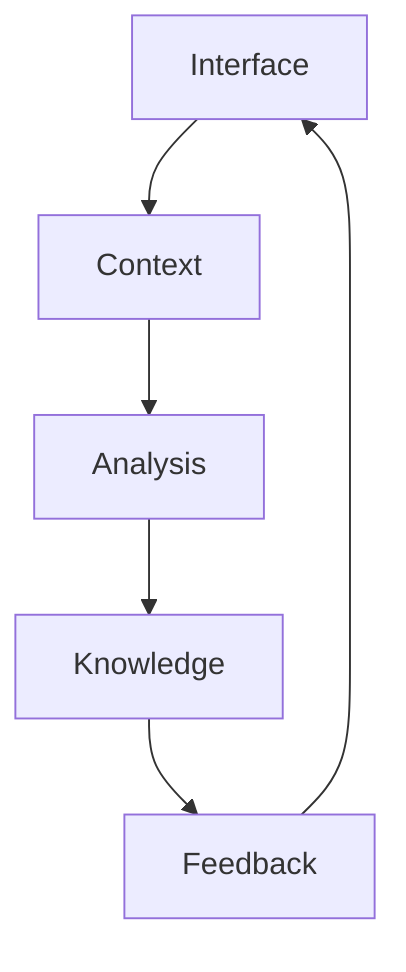

# Digital Alchemy: Technical Implementation

## Core Systems

### 1. Enhanced Context Interface
```typescript
interface ContextInterface {
  // Core state management
  state: {
    contextDepth: number      // Current context depth level
    flowState: FlowState      // User's comprehension flow
    relevance: number         // Context-query relevance
    intention: CodeIntent     // Detected code exploration intent
  }

  // Animation and feedback systems
  feedback: {
    codeFlow: CodeFlowSystem       // Code relationship visualization
    contextParticles: ParticleSystem // Knowledge graph visualization
    transitions: TransitionEngine    // Context navigation transitions
  }

  // Interaction loops
  interaction: {
    visual: CodeVisualFeedback    // Code structure visualization
    haptic: NavigationFeedback    // Mobile navigation feedback
    audio: FocusStateFeedback     // Ambient focus enhancement
  }
}
```

Related docs:
- [[01-ui-components]] - Base component system
- [[03-animation-system]] - Animation framework
- [[17-magic-moment]] - Core interaction philosophy

### 2. Context Intelligence
```typescript
interface ContextIntelligence {
  // Context awareness
  analysis: {
    codeState: CodeAnalysis     // Code structure and patterns
    userContext: UserState      // Knowledge level and focus
    environment: DevEnv         // IDE, platform, tools
  }

  // Adaptation systems
  adaptation: {
    interface: ViewportAdapter     // Display optimization
    knowledge: KnowledgeAdapter    // Content complexity tuning
    assistance: ContextAssistant   // Contextual help system
  }

  // Learning systems
  learning: {
    patterns: CodePatternRecognition
    preferences: UserPreferenceLearning
    optimization: ContextOptimization
  }
}
```

Related docs:
- [[02-ai-integration]] - AI system integration
- [[13-smart-context-handling]] - Context awareness
- [[14-product-vision]] - Core product philosophy

### 3. Knowledge Transformation
```typescript
interface KnowledgeTransform {
  // Core knowledge flow
  flow: {
    extraction: CodeExtractionPhase
    synthesis: KnowledgeSynthesis
    presentation: ContextPresentation
    sharing: KnowledgeSharing
  }

  // Enhancement systems
  enhancement: {
    visual: CodeVisualization
    semantic: SemanticEnrichment
    relational: RelationshipMapping
  }

  // Integration systems
  integration: {
    progress: ProgressTracking
    comprehension: ComprehensionMetrics
    mastery: KnowledgeMastery
  }
}
```

## Implementation Plan

### Phase 1: Foundation (Weeks 1-4)

#### 1.1 Context Interface Base
- [ ] Implement code flow visualization system
- [ ] Create knowledge graph visualization
- [ ] Develop context navigation transitions
- [ ] Build comprehension feedback system

Technical resources:
- D3.js for knowledge visualization
- React Spring for transitions
- Web Audio API for ambient focus
- Haptic feedback for mobile

#### 1.2 Context Intelligence Core
- [ ] Build code analysis system
- [ ] Implement context adaptation logic
- [ ] Create learning framework
- [ ] Develop pattern recognition

Dependencies:
- Tree-sitter for code parsing
- OpenAI API for intelligence
- ChromaDB for embeddings
- WebSocket for real-time updates

#### 1.3 Knowledge Transform MVP
- [ ] Design knowledge extraction flow
- [ ] Implement synthesis engine
- [ ] Create visualization systems
- [ ] Build sharing mechanics

Integration points:
- [[20-llm-pipelines]] for intelligence
- [[21-database-schema]] for storage
- [[16-mobile-interface]] for touch

### Phase 2: Enhancement (Weeks 5-8)

#### 2.1 Advanced Interface
- [ ] Enhanced code visualization
- [ ] Complex knowledge mapping
- [ ] Spatial code navigation
- [ ] Advanced context feedback

#### 2.2 Intelligence Evolution
- [ ] Advanced pattern recognition
- [ ] Predictive context assistance
- [ ] Flow state optimization
- [ ] Knowledge harmonization

#### 2.3 Knowledge Expansion
- [ ] Multi-repository context
- [ ] Enhanced visualizations
- [ ] Cross-language understanding
- [ ] Team knowledge sharing

### Phase 3: Future Features (Weeks 9-12)

#### 3.1 Neural Enhancement
- [ ] Code pattern recognition
- [ ] Intent mapping
- [ ] Focus state detection
- [ ] Learning optimization

#### 3.2 Context Features
- [ ] Context state management
- [ ] Parallel knowledge views
- [ ] Cross-repository linking
- [ ] Knowledge fields

#### 3.3 Collective Systems
- [ ] Team knowledge sharing
- [ ] Shared context spaces
- [ ] Knowledge merging
- [ ] Universal context field

## Technical Architecture

### 1. Core Systems
```typescript
interface SystemArchitecture {
  core: {
    interface: ContextInterface
    intelligence: ContextIntelligence
    knowledge: KnowledgeTransform
  }
  
  integration: {
    ai: AISystem        // [[02-ai-integration]]
    preview: Preview    // [[12-context-preview-workflow]]
    action: Action      // [[22-action-execution]]
  }
  
  infrastructure: {
    database: Database  // [[21-database-schema]]
    pipeline: Pipeline  // [[20-llm-pipelines]]
    mobile: Mobile      // [[16-mobile-interface]]
  }
}
```

### 2. Data Flow


### 3. State Management
```typescript
interface StateManagement {
  interface: InterfaceState
  context: ContextState
  knowledge: KnowledgeState
  collective: TeamState
}
```

## Success Metrics

### 1. User Experience
- Context comprehension speed
- Knowledge transfer rate
- Satisfaction scores
- "Aha!" moment frequency

### 2. System Performance
- Context generation latency
- Visualization smoothness
- Knowledge consistency
- Learning accuracy

### 3. Knowledge Impact
- Code understanding rate
- Documentation quality
- Team knowledge sharing
- Context persistence

## Next Steps

### Immediate (Week 1)
1. Set up visualization framework
2. Implement basic context feedback
3. Create knowledge flow
4. Build context system

### Short Term (Month 1)
1. Enhance intelligence
2. Expand knowledge mapping
3. Improve feedback
4. Add collaboration

### Long Term (Quarter 1)
1. Neural features
2. Context systems
3. Collective knowledge
4. Reality synthesis

*Switches to OK Computer, ready to transmute concepts into code* 🎸