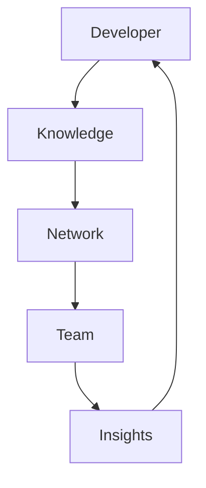

# Reality Social: Technical Implementation

## Core Systems

### 1. Knowledge Stream Engine
```typescript
interface KnowledgeStream {
  // Core streaming
  stream: {
    type: 'code' | 'docs' | 'context' | 'discussion'
    source: Developer
    content: CodeKnowledge
    state: StreamState
  }

  // Real-time components
  realtime: {
    viewers: TeamConnection[]
    interactions: KnowledgeInteraction
    insights: InsightFlow
  }

  // Version control
  versioning: {
    history: CodeHistory
    branches: BranchContext[]
    merges: KnowledgeMerge[]
  }
}
```

Related docs:
- [[12-context-preview-workflow]] - Preview system
- [[20-llm-pipelines]] - AI integration
- [[22-action-execution]] - Action system

### 2. Team Knowledge Fabric
```typescript
interface TeamKnowledgeFabric {
  // Connection management
  connections: {
    developers: DeveloperNode[]
    teams: TeamRelationship[]
    projects: ProjectGroup[]
  }

  // Knowledge flow
  knowledge: {
    feed: KnowledgeFeed
    discovery: CodeDiscovery
    curation: InsightCuration
  }

  // Collaboration systems
  collaboration: {
    reviews: CodeReviewSystem
    
    discussions: ThreadSystem
    pairing: PairProgramming
  }
}
```

Related docs:
- [[13-smart-context-handling]] - Context system
- [[14-product-vision]] - Vision alignment
- [[21-database-schema]] - Data structure

### 3. Knowledge Network
```typescript
interface KnowledgeNetwork {
  // Repository management
  repositories: {
    nodes: RepoNode[]
    connections: CodeLink[]
    state: NetworkState
  }

  // Synchronization
  sync: {
    protocol: GitSync
    conflicts: ConflictResolver
    merging: KnowledgeMerge
  }

  // Distribution
  distribution: {
    routing: KnowledgeRouter
    delivery: InsightDistributor
    cache: ContextCache
  }
}
```

## Implementation Plan

### Phase 1: Foundation (Weeks 1-4)

#### 1.1 Knowledge Streaming
- [ ] Build core knowledge streaming
- [ ] Implement team connections
- [ ] Create interaction system
- [ ] Develop version tracking

Technical stack:
- WebSocket for real-time
- Redis for pub/sub
- PostgreSQL for storage
- Git integration

#### 1.2 Team Core
- [ ] Design team system
- [ ] Build knowledge feed
- [ ] Implement discussions
- [ ] Create review system

Dependencies:
- Neo4j for knowledge graph
- Elasticsearch for code search
- WebSocket for real-time
- S3 for artifact storage

#### 1.3 Network Foundation
- [ ] Design repository protocol
- [ ] Implement code routing
- [ ] Create sync system
- [ ] Build merge engine

Integration points:
- [[02-ai-integration]] for intelligence
- [[16-mobile-interface]] for mobile
- [[03-animation-system]] for visuals

### Phase 2: Enhancement (Weeks 5-8)

#### 2.1 Advanced Streaming
- [ ] Multi-repo streaming
- [ ] Branch context tracking
- [ ] Knowledge navigation
- [ ] Insight visualization

#### 2.2 Team Evolution
- [ ] Advanced code discovery
- [ ] Rich code discussions
- [ ] Collaborative debugging
- [ ] Team knowledge mapping

#### 2.3 Network Expansion
- [ ] Cross-repo knowledge
- [ ] Context mixing
- [ ] State management
- [ ] Distribution optimization

### Phase 3: Future Features (Weeks 9-12)

#### 3.1 Collective Intelligence
- [ ] Team pattern recognition
- [ ] Shared knowledge creation
- [ ] Emergent documentation
- [ ] Knowledge networks

#### 3.2 Knowledge Synthesis
- [ ] Repository blending
- [ ] Context composition
- [ ] State harmonization
- [ ] Knowledge flow

#### 3.3 Team Transcendence
- [ ] Knowledge networks
- [ ] Team features
- [ ] Expertise mapping
- [ ] Universal knowledge

## Technical Architecture

### 1. System Overview
```typescript
interface SystemArchitecture {
  core: {
    stream: KnowledgeStream
    team: TeamKnowledgeFabric
    network: KnowledgeNetwork
  }

  services: {
    ai: AIService         // [[02-ai-integration]]
    preview: Preview      // [[12-context-preview-workflow]]
    action: ActionSystem  // [[22-action-execution]]
  }

  infrastructure: {
    database: Database    // [[21-database-schema]]
    cache: Cache
    queue: MessageQueue
    storage: BlobStorage
  }
}
```

### 2. Data Flow


### 3. State Management
```typescript
interface StateManagement {
  knowledge: KnowledgeState
  team: TeamState
  network: NetworkState
  collective: CollectiveState
}
```

## Success Metrics

### 1. Engagement
- Active developers
- Knowledge retention
- Discussion quality
- Collaboration frequency

### 2. Network Health
- Knowledge density
- Information flow
- Response time
- System harmony

### 3. Knowledge Impact
- Code understanding
- Documentation quality
- Team learning
- Knowledge flow

## Next Steps

### Immediate (Week 1)
1. Set up streaming infrastructure
2. Build basic team features
3. Create knowledge protocol
4. Implement real-time system

### Short Term (Month 1)
1. Enhance streaming
2. Expand team features
3. Optimize network
4. Add collaboration

### Long Term (Quarter 1)
1. Collective features
2. Knowledge synthesis
3. Team networks
4. Universal knowledge

## Integration Points

### 1. Core Systems
```typescript
interface SystemIntegration {
  // AI integration
  ai: {
    contextual: ContextualAI     // [[02-ai-integration]]
    knowledge: KnowledgeAI       // [[20-llm-pipelines]]
    team: TeamAI                 // [[13-smart-context-handling]]
  }

  // Preview system
  preview: {
    generation: PreviewGen       // [[12-context-preview-workflow]]
    distribution: PreviewDist    // [[22-action-execution]]
    interaction: PreviewInt      // [[16-mobile-interface]]
  }

  // Action system
  action: {
    execution: ActionExec        // [[22-action-execution]]
    coordination: ActionCoord    // [[07-context-generation-workflow]]
    feedback: ActionFeed         // [[03-animation-system]]
  }
}
```

### 2. Data Systems
```typescript
interface DataIntegration {
  // Storage systems
  storage: {
    graph: Neo4j               // Knowledge connections
    document: MongoDB          // Content storage
    relational: PostgreSQL     // Core data
    cache: Redis              // Real-time data
  }

  // Processing systems
  processing: {
    stream: Kafka             // Event streaming
    compute: Spark            // Data processing
    search: Elasticsearch     // Code search
    ml: TensorFlow           // Intelligence
  }
}
```