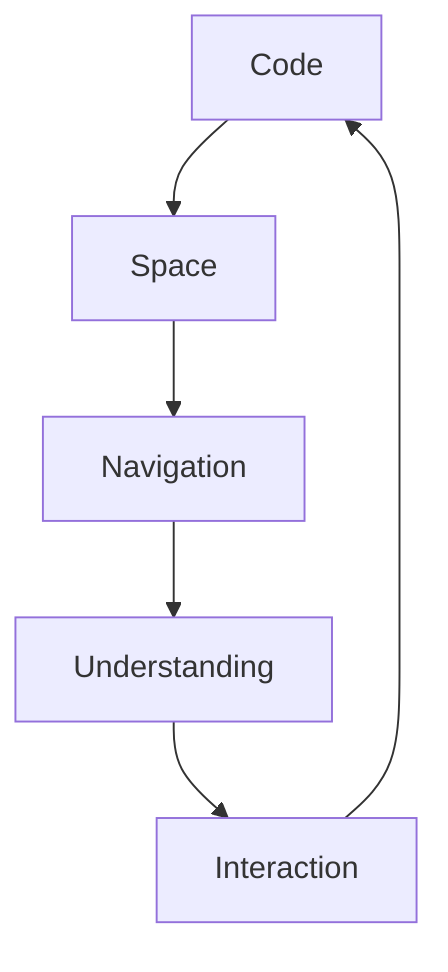

# Spatial Magic: Technical Implementation

## Core Systems

### 1. Spatial Code Interface
```typescript
interface SpatialCode {
  // Core visualization
  visualization: {
    codeSpace: CodeSpaceManager     // 3D code structure
    navigation: SpatialNavigation   // Gesture-based movement
    focus: FocusField              // Attention management
  }

  // Interaction systems
  interaction: {
    gestures: GestureSystem       // Natural code navigation
    touch: TouchInteraction       // Mobile interaction
    motion: MotionControl        // Spatial control
  }

  // Feedback systems
  feedback: {
    visual: VisualResponse      // Visual confirmation
    haptic: HapticFeedback     // Touch response
    audio: SpatialAudio        // 3D audio cues
  }
}
```

Related docs:
- [[01-ui-components]] - Base component system
- [[03-animation-system]] - Animation framework
- [[16-mobile-interface]] - Mobile experience

### 2. Dimensional Context
```typescript
interface DimensionalContext {
  // Space management
  space: {
    codeMap: CodeTopology         // Code structure mapping
    relations: SpatialRelations   // Code relationships
    layers: ContextLayers         // Information layers
  }

  // Navigation
  navigation: {
    pathfinding: CodePathfinder   // Smart navigation
    bookmarks: SpatialBookmarks   // Important locations
    history: NavigationHistory    // Movement tracking
  }

  // Understanding
  comprehension: {
    focus: FocusSystem           // Attention guidance
    context: ContextBubble       // Local context
    overview: GlobalView         // Full perspective
  }
}
```

Related docs:
- [[05-context-management]] - Context system
- [[13-smart-context-handling]] - Context awareness
- [[15-preview-architecture]] - Preview system

### 3. Knowledge Dimensions
```typescript
interface KnowledgeDimensions {
  // Structure mapping
  structure: {
    codebase: CodebaseMap        // Repository structure
    dependencies: DependencySpace // Package relations
    changes: ChangeTimeline      // Version history
  }

  // Visualization
  visualization: {
    layout: SpaceLayout          // 3D arrangement
    rendering: CodeRenderer      // Visual representation
    animation: StateTransition   // State changes
  }

  // Integration
  integration: {
    ide: IDEBridge              // Editor integration
    vcs: VCSConnection          // Version control
    tools: ToolSpace            // Development tools
  }
}
```

## Implementation Plan

### Phase 1: Foundation (Weeks 1-4)

#### 1.1 Spatial Interface
- [ ] Implement 3D code visualization
- [ ] Create gesture navigation
- [ ] Develop spatial feedback
- [ ] Build interaction system

Technical resources:
- Three.js for 3D visualization
- React Three Fiber for React integration
- WebXR for immersive view
- Gesture recognition system

#### 1.2 Context Dimensions
- [ ] Build code topology
- [ ] Implement spatial navigation
- [ ] Create context layers
- [ ] Develop focus system

Dependencies:
- Tree-sitter for code parsing
- Force-directed layout
- Spatial indexing
- WebGL for rendering

#### 1.3 Knowledge Space
- [ ] Design space layout
- [ ] Implement visualization
- [ ] Create navigation
- [ ] Build tool integration

Integration points:
- [[20-llm-pipelines]] for intelligence
- [[21-database-schema]] for storage
- [[22-action-execution]] for actions

### Phase 2: Enhancement (Weeks 5-8)

#### 2.1 Advanced Interface
- [ ] Enhanced code visualization
- [ ] Complex gestures
- [ ] Spatial audio
- [ ] Advanced feedback

#### 2.2 Context Evolution
- [ ] Advanced pathfinding
- [ ] Smart bookmarking
- [ ] Context awareness
- [ ] Focus optimization

#### 2.3 Space Expansion
- [ ] Multi-repo visualization
- [ ] Team spaces
- [ ] Collaborative views
- [ ] Tool integration

### Phase 3: Future Features (Weeks 9-12)

#### 3.1 Spatial Intelligence
- [ ] Smart space organization
- [ ] Gesture prediction
- [ ] Focus optimization
- [ ] Navigation learning

#### 3.2 Context Features
- [ ] Advanced topology
- [ ] Relationship mapping
- [ ] History visualization
- [ ] Change tracking

#### 3.3 Integration Systems
- [ ] IDE plugins
- [ ] VCS integration
- [ ] Tool embedding
- [ ] Team spaces

## Technical Architecture

### 1. Core Systems
```typescript
interface SystemArchitecture {
  core: {
    spatial: SpatialCode
    context: DimensionalContext
    knowledge: KnowledgeDimensions
  }
  
  integration: {
    ai: AISystem        // [[02-ai-integration]]
    preview: Preview    // [[12-context-preview-workflow]]
    action: Action      // [[22-action-execution]]
  }
  
  infrastructure: {
    database: Database  // [[21-database-schema]]
    pipeline: Pipeline  // [[20-llm-pipelines]]
    mobile: Mobile      // [[16-mobile-interface]]
  }
}
```

### 2. Data Flow


### 3. State Management
```typescript
interface StateManagement {
  spatial: SpatialState
  context: ContextState
  navigation: NavigationState
  interaction: InteractionState
}
```

## Success Metrics

### 1. User Experience
- Navigation efficiency
- Context understanding
- Interaction fluidity
- Learning curve

### 2. System Performance
- Rendering performance
- Interaction latency
- Memory usage
- Battery impact

### 3. Knowledge Impact
- Code comprehension
- Navigation speed
- Context retention
- Tool integration

## Next Steps

### Immediate (Week 1)
1. Set up 3D visualization
2. Implement basic gestures
3. Create spatial navigation
4. Build feedback system

### Short Term (Month 1)
1. Enhance visualization
2. Expand navigation
3. Improve context
4. Add collaboration

### Long Term (Quarter 1)
1. Spatial features
2. Context systems
3. Tool integration
4. Team spaces

## Integration Points

### 1. Core Systems
```typescript
interface SystemIntegration {
  // AI integration
  ai: {
    spatial: SpatialAI       // [[02-ai-integration]]
    context: ContextualAI    // [[20-llm-pipelines]]
    navigation: NavigationAI // [[13-smart-context-handling]]
  }

  // Preview system
  preview: {
    visualization: VisualGen    // [[12-context-preview-workflow]]
    interaction: InteractionGen // [[22-action-execution]]
    feedback: FeedbackGen       // [[16-mobile-interface]]
  }

  // Action system
  action: {
    execution: ActionExec     // [[22-action-execution]]
    coordination: ActionCoord // [[07-context-generation-workflow]]
    feedback: ActionFeed      // [[03-animation-system]]
  }
}
```

### 2. Data Systems
```typescript
interface DataIntegration {
  // Storage systems
  storage: {
    spatial: Redis           // Spatial indexes
    context: Neo4j          // Context graph
    state: PostgreSQL       // Core data
    cache: Redis           // Real-time data
  }

  // Processing systems
  processing: {
    rendering: WebGL        // 3D rendering
    physics: Cannon.js      // Spatial simulation
    gestures: TensorFlow    // Gesture recognition
    audio: Web Audio API    // Spatial audio
  }
} 