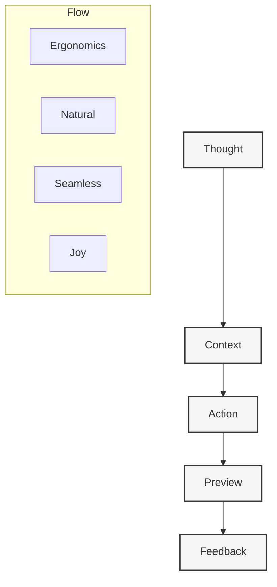

# Project Documentation Index

#project-overview #documentation #source-of-truth

## Core Philosophy

## Core Documentation

### 1. Foundation
- [[00-project-overview|Project Overview]] - Core vision and goals
- [[19-ergonomics|Ergonomics]] - Design philosophy
- [[14-product-vision|Product Vision]] - Product direction
- [[06-implementation-plan|Implementation Plan]] - Development roadmap

### 2. Technical Architecture
- [[10-architectural-review|Architectural Review]] - System architecture
- [[09-package-integrations|Package Integrations]] - Package structure
- [[21-database-schema|Database Schema]] - Data models
- [[04-development-workflow|Development Workflow]] - Development practices

### 3. Core Systems
- [[05-context-management|Context Management]] - Context system
- [[07-context-generation-workflow|Context Generation]] - Generation pipeline
- [[02-ai-integration|AI Integration]] - Provider system
- [[20-llm-pipelines|LLM Pipelines]] - Template system

### 4. Preview & Deployment
- [[12-context-preview-workflow|Preview Workflow]] - Preview system
- [[11-preview-deployments|Preview Deployments]] - Deployment system
- [[15-preview-architecture|Preview Architecture]] - Architecture
- [[22-action-execution|Action Execution]] - Action system

### 5. User Experience
- [[01-ui-components|UI Components]] - Core components
- [[03-animation-system|Animation System]] - Motion design
- [[16-mobile-interface|Mobile Interface]] - Mobile experience
- [[08-notification-system|Notification System]] - Notifications

### 6. Product & Marketing
- [[17-magic-moment|Magic Moment]] - Core experience
- [[18-marketing|Marketing]] - Communication
- [[13-smart-context-handling|Smart Context]] - Intelligence

## Technical Stack

### Core Technologies
- Next.js 15 (App Router)
- React 19
- TypeScript 5
- Tailwind CSS

### State Management
- Zustand for global state
- React Query for server state
- Zod for schema validation

### Database & Storage
- Prisma ORM
- PostgreSQL
- Vector storage (Pinecone)

### AI Integration
- Multi-provider system
- OpenAI (GPT-4, embeddings)
- Anthropic (Claude)
- Google (Gemini)

### Preview System
- Vercel for deployments
- Edge functions
- Real-time updates

## Development Guidelines

### 1. Context Management
- Always check package structure
- Consider existing patterns
- Reference documentation
- Follow ergonomic principles

### 2. Code Organization
- Maintain clear package boundaries
- Use TypeScript strictly
- Follow monorepo practices
- Keep dependencies minimal

### 3. AI Integration
- Use provider system
- Handle errors gracefully
- Stream responses
- Monitor performance

### 4. Testing Strategy
- Unit tests for core logic
- Integration tests for flows
- E2E tests for critical paths
- Performance monitoring

## Agent Guidelines

When working with this codebase, you should:

### 1. Context Awareness
- Check package structure before changes
- Consider existing patterns
- Reference relevant documentation
- Follow ergonomic principles

### 2. Implementation Flow
1. **Start with Context**
   - Review relevant documentation
   - Understand existing patterns
   - Check package boundaries

2. **Plan Changes**
   - Consider ergonomic impact
   - Follow existing patterns
   - Think about scalability

3. **Execute Changes**
   - Make atomic commits
   - Update documentation
   - Add proper tests

4. **Validate Results**
   - Check against requirements
   - Verify performance
   - Test edge cases

### 3. Key Principles
- Maintain ergonomic flow
- Keep things simple
- Think about UX
- Document changes

## Future Roadmap

### Phase 1: Core Experience
- Context generation
- Preview system
- Mobile interface

### Phase 2: Enhanced Features
- Team collaboration
- Advanced previews
- Analytics

### Phase 3: Scale & Polish
- Enterprise features
- Performance optimization
- Advanced monitoring 