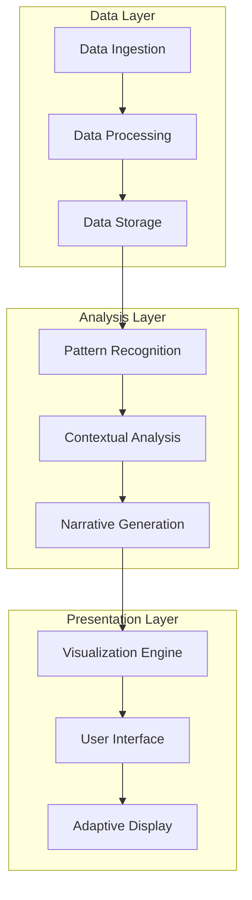
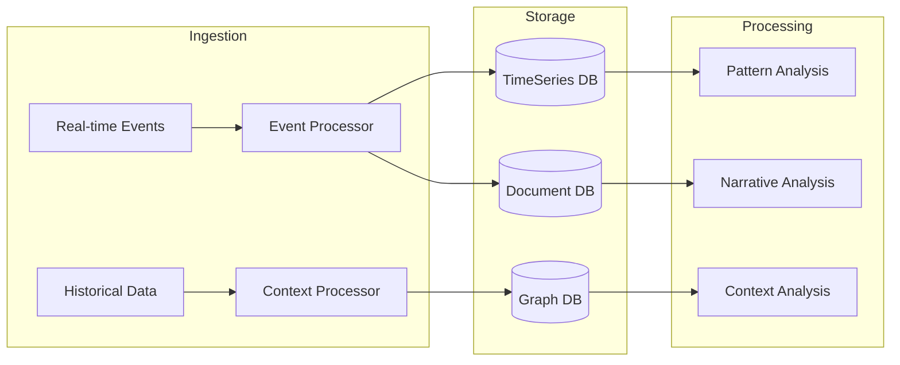
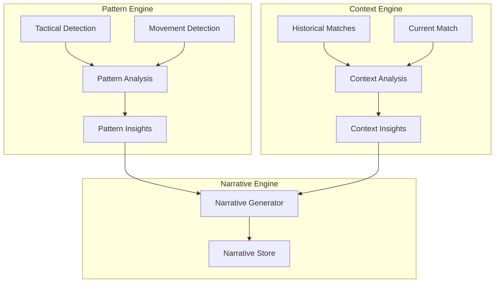
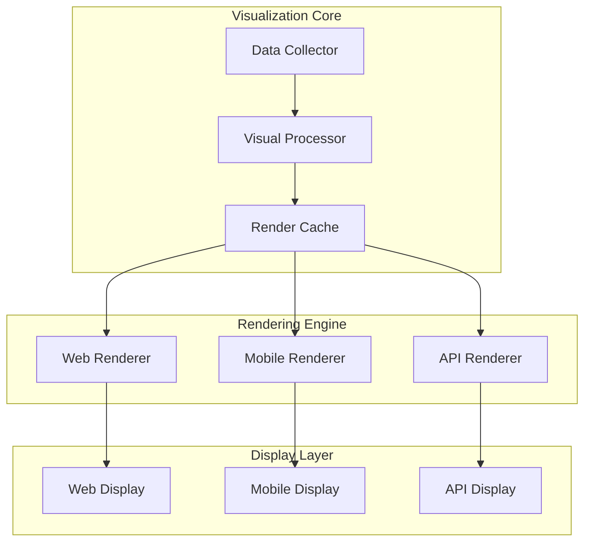

# System Architecture Development Prompts

## Context & Philosophy
Our architecture must support the transformation of football data into compelling narratives. Every component, from data ingestion to visualization, should work together to reveal the game's patterns, stories, and beauty.

## Role Definition
You are a system architect tasked with designing a scalable, resilient platform that captures football's complexity while making it accessible through storytelling.

## System Overview



## Core Architecture Components

### 1. Data Processing Architecture
```typescript
interface DataArchitecture {
  ingestion: {
    realtime: "Match events and statistics"
    batch: "Historical data and context"
    streaming: "Live match data feeds"
  }

  processing: {
    eventProcessing: "Real-time event handling"
    patternDetection: "Tactical and technical analysis"
    contextEnrichment: "Historical context integration"
  }

  storage: {
    timeseriesDB: "Event and metric storage"
    graphDB: "Relationship and pattern storage"
    documentDB: "Narrative and context storage"
  }
}
```

**System Diagram:**


### 2. Analysis Architecture
```typescript
interface AnalysisArchitecture {
  patterns: {
    tactical: "Formation and strategy analysis"
    technical: "Player and team performance"
    temporal: "Game flow and momentum"
  }

  context: {
    historical: "Past match analysis"
    situational: "Current match context"
    comparative: "Similar situation analysis"
  }

  narrative: {
    generation: "Story construction"
    adaptation: "Personalized content"
    delivery: "Multi-platform distribution"
  }
}
```

**System Diagram:**


### 3. Visualization Architecture
```typescript
interface VisualizationArchitecture {
  rendering: {
    realtime: "Live match visualization"
    interactive: "User-driven exploration"
    narrative: "Story-based presentation"
  }

  components: {
    tactical: "Formation and movement viz"
    statistical: "Data and metrics viz"
    contextual: "Historical comparison viz"
  }

  delivery: {
    web: "Browser-based rendering"
    mobile: "Device-optimized views"
    api: "Third-party integration"
  }
}
```

**System Diagram:**


## Implementation Guidelines

1. **System Integration**
   ```mermaid
   graph LR
       DI[Data Ingestion] --> DP[Data Processing]
       DP --> DS[Data Storage]
       DS --> AE[Analysis Engine]
       AE --> VE[Visualization Engine]
       VE --> UI[User Interface]
   ```

2. **Data Flow**
   ```mermaid
   graph TB
       RE[Raw Events] --> EP[Event Processing]
       EP --> PA[Pattern Analysis]
       PA --> CA[Context Analysis]
       CA --> NG[Narrative Generation]
       NG --> VP[Visual Processing]
       VP --> UI[User Interface]
   ```

3. **Scalability Strategy**
   ```mermaid
   graph TB
       subgraph Load Balancing
           LB[Load Balancer] --> S1[Server 1]
           LB --> S2[Server 2]
           LB --> S3[Server N]
       end
       
       subgraph Processing
           S1 --> C1[Cache]
           S2 --> C2[Cache]
           S3 --> C3[Cache]
       end
       
       subgraph Storage
           C1 --> DB[(Database)]
           C2 --> DB
           C3 --> DB
       end
   ```

## Quality Standards

- System Availability > 99.99%
- Data Processing Latency < 500ms
- Query Response Time < 100ms
- Visualization Render Time < 50ms
- System Scalability: 100K+ concurrent users
- Data Consistency: 100%

## Deliverables

1. System Architecture Documentation
2. Component Integration Specifications
3. Data Flow Diagrams
4. Scaling Strategy Documentation
5. Performance Optimization Guidelines
6. Deployment Architecture Specifications

Remember: Our architecture should enable the transformation of raw football data into rich, meaningful narratives that enhance understanding and appreciation of the beautiful game. 