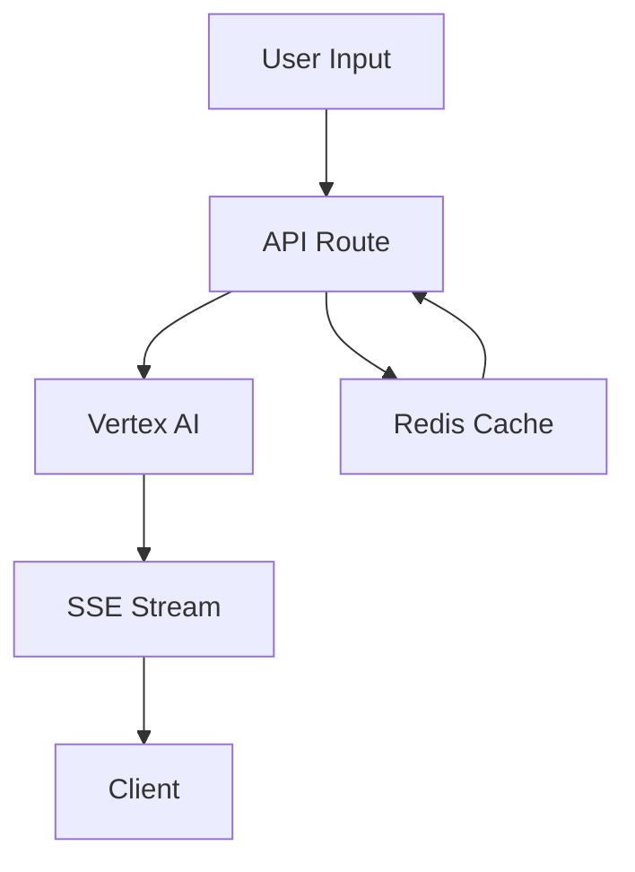

# January 15, 2024: Hero Section & API Infrastructure

## Overview
Enhanced the marketing hero section with real AI integration and streaming responses. Built out core API infrastructure for context management. Started development of the documentation site with auto-generation capabilities.

## Key Changes

### 1. AI Integration
```typescript
// Moved from client-side to API routes
// Using Vertex AI with Gemini Pro model
const vertexai = new VertexAI({
  project: process.env.GOOGLE_CLOUD_PROJECT,
  location: 'us-central1'
})
```

### 2. Streaming Architecture
- Server-Sent Events for real-time streaming
- Character-by-character text animation
- Smooth scrolling and cursor feedback

### 3. Response Caching
- Redis-based caching for common queries
- Cache invalidation after 1 hour
- Fallback handling for cache misses

### 4. API Infrastructure
- Core context management endpoints
- Message handling system
- Action execution pipeline
- Preview generation system

### 5. Documentation System
- Mintlify setup with custom theme
- Initial navigation structure
- Core concept documentation
- API reference framework
- Auto-generation system design

## Technical Details

### AI Pipeline


### Context API Structure
```typescript
// Core API routes
api/
  ├── contexts/
  │   ├── [id]/
  │   │   ├── messages/  // Message handling
  │   │   ├── actions/   // Action execution
  │   │   └── previews/  // Preview management
  │   └── route.ts      // Context CRUD
  └── health/          // Health checks
```

### Documentation Architecture
```typescript
interface DocGenerator {
  // Convert context to Mintlify MDX
  generateMDX(context: Context): MDXContent
  // Extract code examples
  extractExamples(context: Context): CodeExample[]
  // Create API references
  generateAPIRef(context: Context): APIReference
}
```

### Response Format
```typescript
interface HeroResponse {
  response: string
  tags: string[]
  options: string[]
  tools: string[]
}
```

### Context Management
```typescript
interface Context {
  id: string
  status: 'setup' | 'active' | 'completed'
  flow: {
    resistance: "none"
    friction: "minimal"
    direction: "natural"
  }
  config: Record<string, any>
}
```

## Implementation Details

### 1. Context Endpoints
- POST /api/contexts - Create new context
- GET /api/contexts - List user contexts
- GET /api/contexts/[id] - Get specific context
- PATCH /api/contexts/[id] - Update context
- DELETE /api/contexts/[id] - Delete context

### 2. Message System
- POST /api/contexts/[id]/messages - Send message
- GET /api/contexts/[id]/messages - Get context messages
- Supports user, assistant, and system messages
- Prepared for AI integration

### 3. Action System
- POST /api/contexts/[id]/actions - Create action
- GET /api/contexts/[id]/actions - List actions
- Supports various action types:
  - clone_template
  - configure_tooling
  - modify_files
  - deploy
  - install_dependencies
  - run_tests
  - generate_preview

### 4. Preview System
- POST /api/contexts/[id]/previews - Create preview
- GET /api/contexts/[id]/previews - List previews
- Supports URL and deployment management
- Ready for Vercel integration

### 5. Documentation System
- Custom Mintlify theme setup
- Navigation structure defined
- Core concept pages planned
- API reference structure created
- Auto-generation system designed

## Next Steps
1. Add more preset prompts
2. Enhance error handling
3. Implement analytics
4. Add A/B testing for responses
5. Fix package exports (@repo/auth, @repo/database)
6. Implement AI pipeline integration
7. Add real-time updates with WebSocket
8. Add rate limiting
9. Implement documentation auto-generation
10. Create core concept guides
11. Build API reference pages

## Notes
- Moved from OpenAI to Vertex AI for better streaming
- Added caching to improve response times
- Enhanced UX with smooth animations
- Maintained JSON structure for responses
- Built foundational API infrastructure
- Prepared for AI and preview integration
- Started documentation system development 