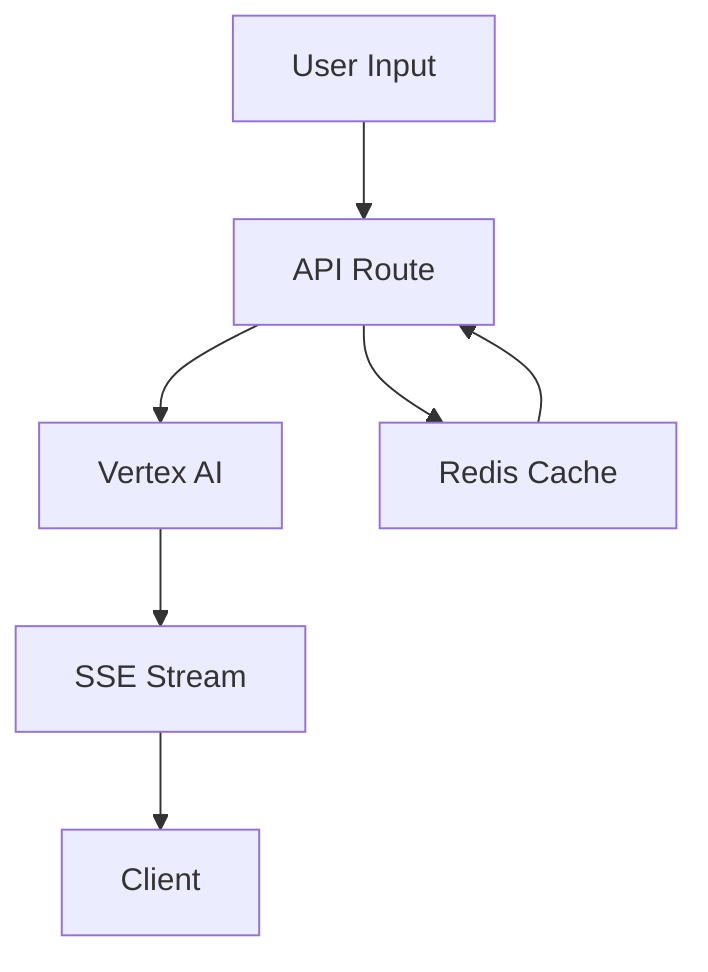

# January 15, 2024: Hero Section & API Infrastructure

## Overview
Enhanced the marketing hero section with real AI integration and streaming responses. Built out core API infrastructure for context management. Started development of the documentation site with auto-generation capabilities.

## Key Changes

### 1. AI Integration
```typescript
// Moved from client-side to API routes
// Using Vertex AI with Gemini Pro model
const vertexai = new VertexAI({
  project: process.env.GOOGLE_CLOUD_PROJECT,
  location: 'us-central1'
})
```

### 2. Streaming Architecture
- Server-Sent Events for real-time streaming
- Character-by-character text animation
- Smooth scrolling and cursor feedback

### 3. Response Caching
- Redis-based caching for common queries
- Cache invalidation after 1 hour
- Fallback handling for cache misses

### 4. API Infrastructure
- Core context management endpoints
- Message handling system
- Action execution pipeline
- Preview generation system

### 5. Documentation System
- Mintlify setup with custom theme
- Initial navigation structure
- Core concept documentation
- API reference framework
- Auto-generation system design

### 6. App Router & Marketing Pages
- Restructured app router with marketing routes
- Removed 'Store' from navigation
- Created Pro and Developers pages with dedicated sections
- Implemented Pro Hero with focus on premium features
- Implemented Developers Hero with focus on developer experience
- Added motion animations and responsive design

### 7. UI & Animation Improvements
- Fixed mobile padding in header component
- Improved animation reliability and timing
- Replaced CSS animations with Framer Motion for better control
- Updated animation keyframes with proper visibility states
- Added smoother easing curves for transitions

### 8. Teams Page Implementation
- Created complete Teams page structure with dedicated sections
- Implemented TeamsHero with focus on team collaboration
- Built CollaborationFeatures showcasing key team capabilities
- Added ContextSharing with visual preview and animations
- Developed TeamManagement with comprehensive features grid
- Created SecurityCompliance highlighting enterprise security
- Implemented TeamsCTA with statistics and trial options

**Key Files:**
```typescript
// Navigation and Pages
apps/web/components/marketing/header.tsx
apps/web/app/(marketing)/(routes)/pro/page.tsx
apps/web/app/(marketing)/(routes)/developers/page.tsx

// Hero Components
apps/web/components/marketing/sections/pro/hero.tsx
apps/web/components/marketing/sections/developers/hero.tsx

// Teams Page and Components
apps/web/app/(marketing)/(routes)/teams/page.tsx
apps/web/components/marketing/sections/teams/hero.tsx
apps/web/components/marketing/sections/teams/collaboration-features.tsx
apps/web/components/marketing/sections/teams/context-sharing.tsx
apps/web/components/marketing/sections/teams/team-management.tsx
apps/web/components/marketing/sections/teams/security-compliance.tsx
apps/web/components/marketing/sections/teams/teams-cta.tsx
```

**Next Steps:**
1. Complete remaining Pro page sections
   - AI Features
   - Advanced Preview
   - Custom Themes
   - Team Collaboration
   - Pricing CTA

2. Complete remaining Developers page sections
   - Dev Tools
   - API Reference
   - Extension System
   - Smart Context
   - Developer CTA

3. Implement Teams page with similar structure

## Technical Details

### API Pipeline


### Context API Structure
```typescript
// Core API routes
api/
  ├── contexts/
  │   ├── [id]/
  │   │   ├── messages/  // Message handling
  │   │   ├── actions/   // Action execution
  │   │   └── previews/  // Preview management
  │   └── route.ts      // Context CRUD
  └── health/          // Health checks
```

### Documentation Architecture
```typescript
interface DocGenerator {
  // Convert context to Mintlify MDX
  generateMDX(context: Context): MDXContent
  // Extract code examples
  extractExamples(context: Context): CodeExample[]
  // Create API references
  generateAPIRef(context: Context): APIReference
}
```

## Next Steps
1. Add more preset prompts
2. Enhance error handling
3. Implement analytics
4. Add A/B testing for responses
5. Fix package exports (@repo/auth, @repo/database)
6. Implement AI pipeline integration
7. Add real-time updates with WebSocket
8. Add rate limiting
9. Implement documentation auto-generation
10. Create core concept guides
11. Build API reference pages 

**Key Changes:**
```typescript
// Header improvements
- Added proper mobile padding
- Switched to Framer Motion for animations
- Implemented staggered animation sequence
- Improved hover and interaction states

// Animation system
- Updated keyframes with visibility states
- Added cubic-bezier easing
- Improved animation timing
- Fixed initial load flickering
```

**Files Modified:**
- `apps/web/components/marketing/header.tsx`
- `packages/tailwind-config/config.ts`

**Technical Details:**
- Using `cubic-bezier(0.16, 1, 0.3, 1)` for smooth easing
- Proper animation sequencing with delays
- Visibility handling for initial load
- Responsive padding and spacing 